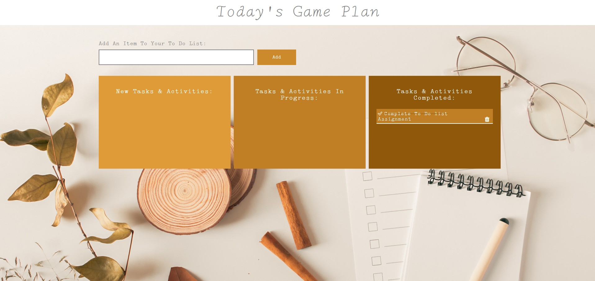

# To Do List Application
This repo is for MMED:1054: Multimedia Authoring Assignment 3

## Installation
No installation required. Simply download the zip file and extract.

## Usage
Open the `index.html` file in the browser of your choice.

## Contributing 
- Fork it! 
- Create your feature branch:`git checkout - b my-new-feature`
- Commit your changes: `git commit -am ‘Add some feature’` 
- Push to the branch: `git push origin my-new-feature`
- Submit a pull request 

## Credits
- Crystal Underhill 

## Licence 
See MIT Licence file
